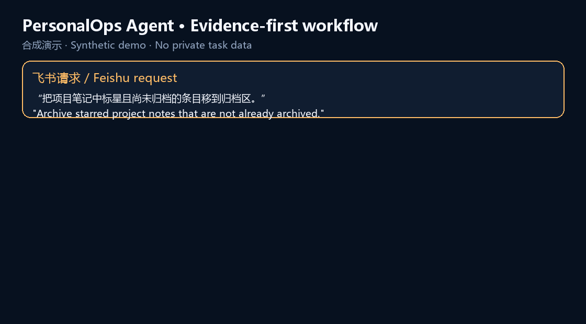
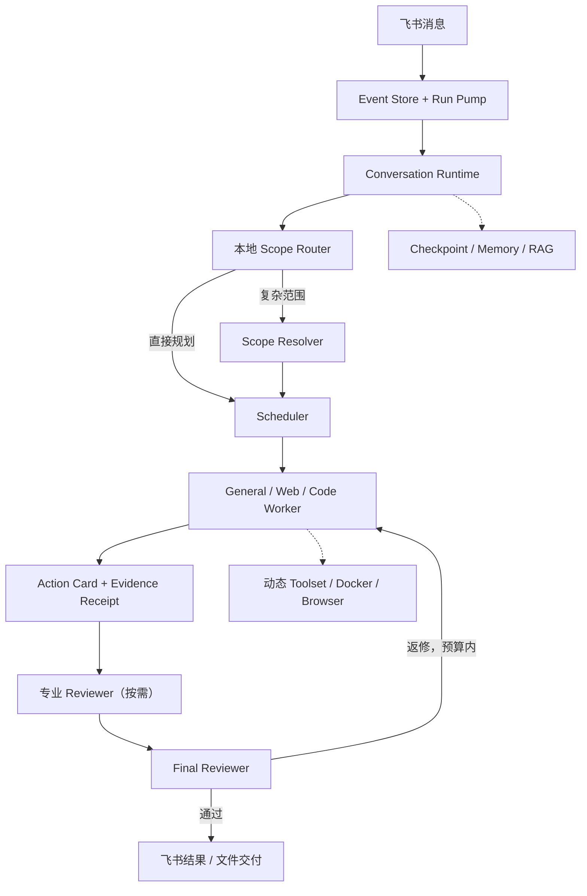

<div align="center">

# PersonalOps Agent

**面向真实工具调用的个人智能 Agent：先明确范围，再执行、验收和返修。**

[English](README.en.md) · [评测方法与完整分位数](docs/benchmark.md) · [Hugging Face 模型与数据](https://huggingface.co/chris0809)

[](https://www.python.org/)
[](https://open.feishu.cn/)
[](https://github.com/langchain-ai/langgraph)
[](docs/benchmark.md)



</div>

## 📊 为什么做这次评测

工具型 Agent 最容易出现的问题，不是“不会聊天”，而是选错对象、调用错接口、写入后没有回读，或在 Worker 交接后重复劳动。因此项目用 AppWorld 的模拟业务环境检查完整任务结果，而不是把模型自报成功当成通过。

在 **AppWorld Test-N Normal 168 题**中，每题只运行一次、失败不重跑，官方评测通过 **125/168，Pass@1 74.4%**。云端规划与执行只使用 Qwen3.8-Flash 与 GLM-5.3-Flash，未使用 Max/Pro 档或高推理模式；任务级平均缓存命中率 **78.9%**，单题成本 P50 **约 ¥0.112**、P90 **约 ¥0.355**，端到端耗时 P50 **215.1 秒**、P90 **645.9 秒**。

> 成本按可观测 usage 和公开价格估算；16 次请求缺少 usage/cost，因此总成本是下界。原题、模拟账号、Trace 和运行归档只保存在本地，仓库仅发布[聚合统计和评测口径](docs/benchmark.md)。

## 👤 项目定位

PersonalOps Agent 通过飞书长连接接收消息，使用可独立配置的模型完成对话理解、任务拆分与结果生成。General、Web、Code、Reporter、Scheduler 等角色可以分别选择供应商与 API，详见 [独立模型配置](docs/model-roles.md)。

对于简单问题，系统可以直接回答；对于需要检索、浏览器操作或文件处理的任务，系统会先判断是否需要规划，再按步骤调用对应工具，最后统一检查结果。

这个项目目前更接近一套个人 Agent 实验实现，而不是开箱即用的 SaaS 产品。代码重点放在运行链路、上下文管理、工具边界和可恢复状态上。

> **面向个人使用：** 当前所有飞书入口共享同一个 owner 会话域。新消息先持久化为 Event，再由单消费者 Run Pump 按顺序执行；正在运行的任务不会阻止后续消息继续入队。设计目标是让个人任务状态保持连续，而不是提供多租户协作能力。

<br>

## ✨ 已实现的能力

### 飞书对话入口

- 使用飞书应用长连接接收消息，无需额外提供公网回调地址
- 飞书消息先持久化入队，后台单消费者串行执行，避免连续消息覆盖状态
- 普通消息按 FIFO 等待；`/insert` 在安全节点暂停当前任务并优先执行
- `/replace 新要求` 在安全节点替换旧 Run，只继承已验收 handoff 与干净的 Git integration，再由新 Scheduler 完整规划
- `/cancel` 在安全节点终止当前任务，保留 Trace、Checkpoint 和归档证据
- 正常答复后附带紧凑的飞书卡片操作栏；可点击“提交 RAG”让下一条文本或文档只进入知识库，也可使用帮助、插入、替换、取消和记忆清理，卡片失败时仍可使用文本命令
- Code Reviewer 或 Web Step Reporter 批准的用户交付物会生成同一张独立交付请求；human 模式等待批准，auto 模式按同一确定性流程交付
- 每个 Conversation 使用独立的正式 workspace，并为最终交付创建本地 Git commit
- 支持创建、查看和切换独立对话
- 任务执行过程中可回传阶段性进度

可用命令：

```text
/help               查看使用说明
/new [标题]         创建并切换到新对话
/list               查看最近对话
/switch 编号或短ID  切换对话
/current            查看当前对话
/insert 内容         安全暂停当前任务，优先处理后自动恢复
/replace 新要求     在安全节点替换当前任务并重新规划
/cancel              在安全节点取消当前运行任务
/clean               逐组清理冲突记忆；可选 A、B、跳过或退出
/exit                退出当前快捷输入或记忆清理模式
/approve 交付编号    批准Reviewer已验收的文件进入当前对话工作区
/reject 交付编号 原因 拒绝交付，不修改正式工作区
```

### 分层任务执行

系统没有把所有请求直接交给一个无限循环的 Agent，而是把职责拆成几个较明确的阶段：

1. **Scope Router / Resolver** 判断请求是否需要额外的对象范围解析，并生成轻量 Scope Contract。
2. **Scheduler** 生成有限步骤的计划，并集中管理模型轮次、工具调用和重试预算。
3. **General / Web / Code Worker** 只处理当前步骤，并按需选择工具集。
4. **Step Reporter / 专业 Reviewer** 将执行轨迹整理为结构化证据并按需返修。
5. **Final Reviewer** 从完整目标检查终态；失败优先返回最后一个 Worker，在预算耗尽后才交给 Scheduler 重规划。

每一层都有明确的次数上限。即使外部工具异常或模型没有按预期返回，流程也会尝试形成可解释的结束状态，而不是无限执行。

### 动态工具集

项目按照能力域组织工具，而不是把全部工具长期暴露给模型。

当前注册的 Toolset 包括：

| Toolset | 用途 |
| --- | --- |
| `WEB_RESEARCH` | 时间确认、网页搜索和公开信息读取 |
| `BROWSER_AUTOMATION` | 页面导航、点击、输入和表单交互 |
| `FILE_INSPECTION` | 目录浏览、文件查找、文本读取与搜索 |
| `FILE_EDITING` | 文本文件创建、写入和精确替换 |
| `SOFTWARE_DEVELOPMENT` | Python、Git、测试及其他 Shell 调试任务 |
| `SCHEDULED_AUTOMATION` | 持久化日程、Windows/飞书提醒与一次性 Agent Event |
| `EMAIL_READING` | 本地 IMAP 邮件读取、受控附件下载与只存不发的草稿 |
| `DESKTOP_OBSERVATION` | Windows 桌面截图与本地 OCR；不含点击和输入 |

Toolset Router 先用本地 Cross Encoder 在用户请求与当前 Step 上选择少量能力域；低置信度时才调用当前 Worker 的同款模型做一次短选择。缺少必需工具的 Toolset 不会被标记为可用，完整工具目录也不会长期塞进每一轮上下文。

### 飞书一键提交 RAG

点击飞书控制卡片中的 **“提交 RAG”** 后，下一条消息只进入本地知识库，不会触发 Agent 执行。支持 TXT、Markdown、JSON/JSONL、CSV、HTML、PDF、DOCX、XLSX 和 PPTX：普通文档保留标题与章节结构；API JSON/OpenAPI 自动建立“应用—资源—读写—接口”目录；扫描版 PDF 在直接解析无文字时才进入隔离 OCR 进程。格式错误、无可读文字或不支持的文件会收到明确拒绝消息。

所有上传内容、向量库和解析回执均保存在 Git 忽略的 `.agent/rag/`，不会进入仓库。

### Playwright MCP

浏览器能力通过 Playwright MCP 接入。

程序启动时建立持久 MCP 会话，并从服务端实际返回的工具中按白名单注册浏览器能力。浏览器导航、页面快照、点击、输入和多标签页操作因此可以继续沿用 MCP 的工具协议，而不需要把浏览器逻辑写进主 Agent。

### 只读邮箱 MCP

邮箱能力默认关闭。配置 QQ/Foxmail 或其他标准 IMAP 邮箱后，程序在本地启动固定版本的只读 MCP，并由宿主白名单注册连接检查、近期邮件、短摘要、正文、附件清单和受控附件下载；另有一个只向 Drafts 执行 IMAP APPEND 的本地草稿工具。附件只进入 Git 忽略的专用目录，系统没有发送、删除、移动或标记邮件的入口。配置方式和安全边界见[本地只读邮箱 MCP](docs/email_reading_mcp.md)。

### 多会话与可恢复状态

- LangGraph Checkpoint 使用 SQLite 持久化
- 每个 Conversation 使用独立 thread id
- 对话可通过列表编号或短 ID 切换
- 同一对话的执行和记忆写入保持顺序
- 退出时依次停止消息接收、等待任务结束，再关闭 SQLite、Memory Store 与 MCP 资源

运行数据默认保存在 `.agent/`，该目录不会提交到 Git。

### Reviewer 与最终 Workspace 交付

Code Reviewer 的 `APPLIED` 只表示候选文件已经通过技术验收，并进入本次
Run 的 `integration/` Git 历史；它不等于用户工作区已经改变。最终文件由
Harness 根据持久化的 manifest、文件 hash 和目标基线生成 Promotion：

- `RUNTIME_DELIVERY_APPROVAL_MODE=human`：飞书收到交付单后使用
  `/approve` 或 `/reject` 决定；
- `RUNTIME_DELIVERY_APPROVAL_MODE=auto`（当前开发默认）：Reviewer 通过后自动走同一套
  校验、复制、提交和回执流程。

正式文件按 Conversation 隔离在
`workspace/conversations/conversation-<stable-hash>/`。Run 的 private、
candidate、handoff、integration 和 staging 属于内部施工现场；终态超过
`RUNTIME_WORKER_WORKSPACE_RETENTION_MINUTES` 后会在程序启动时清理大体积
目录，默认保留十天。正式 Conversation Workspace、Event 状态、Trace ID
和小型 receipts 不会被这个清理器删除。

Web / General Step 通过 `artifact_outputs` 区分两类产物：

- `INTERNAL_HANDOFF` 只进入本次 Run 的共享 handoff，供后续 Worker 只读使用；
- `USER_DELIVERABLE` 必须由 Scheduler 提前声明安全目标路径，并由 Worker绑定候选、Step Reporter批准、Harness核验后，才会与 Code 文件汇总到同一张最终 Promotion。

Worker 和 Reporter 都不直接写正式 Workspace；它们分别负责生产与审批，确定性 Publisher 和 Promotion Service 负责实际复制、hash 校验、冲突检测和 Git 回执。

<br>

## 🧩 上下文是如何控制的

项目将长期对话摘要与 Worker 上下文隔离分开处理。Worker 内部压缩默认关闭，避免工具回执、错误和最新交接在同一任务中丢失；需要时可通过配置显式开启。

### Conversation Rolling Summary

当对话累计到配置阈值后，较早的对话会被更新为滚动摘要。Scope Resolver、Scheduler、Replanner 和 Final Reviewer 使用这份摘要，同时只携带有限数量的最近对话。

这样可以保留目标、约束和关键结果，又避免规划节点持续读取完整历史。

### Worker 上下文隔离

每个步骤仍会统计消息与 Token，但 `WORKER_COMPACTION_ENABLED=false` 是当前默认值：同一 Worker 的工具调用、成功返回、错误返回和最新交接完整保留。跨 Worker 只注入结构化交接与验收回执，借助上下文隔离控制长度。只有显式开启压缩时，Middleware 才会修复 AI/Tool 消息配对并摘要较早轨迹。

Worker、Web Worker、Code Worker 与 Code Reviewer 的最终结构化提交如果被 Harness 判为字段或引用格式错误，会由原角色只修表，不重新执行业务动作，也不立即唤醒 Reviewer。该独立额度由 `RUNTIME_WORKER_SCHEMA_REPAIR_MAX_ROUNDS` 控制，当前默认及硬上限均为 3；真实模型调用仍计入整轮 Plan 的总成本与安全上限。

<br>

## 🧠 记忆检索

长期记忆保存在 SQLite Store 中，并使用本地模型完成检索：

- `gte-multilingual-base`：向量表示
- 本地 BM25：对规范化摘要、typed字段和宿主生成的三元组执行精确词项召回；中文使用轻量二元切分，不常驻额外分词模型
- `BCE Reranker`：中英文CrossEncoder读取门控；默认使用0.4阈值，可通过`MEMORY_RERANKER_THRESHOLD`校准
- `MemOperator-0.6B + LoRA分类头`：只对用户原话执行后台Write Gate；普通消息累计3条后批量判断，模型按需加载并在推理后释放。公开模型与20K双语训练集见[Hugging Face](https://huggingface.co/chris0809/memoperator-0.6b-memory-write-gate)

Write Gate不会直接生成正式长期记忆。明确的“请记住”类请求直接进入候选区；其余普通用户消息先持久化到待判队列，由微调后的本地分类器直接输出`SAVE/SKIP`，不再让生成模型组织JSON。候选默认累计10条后进入两轮云端提取：第一轮只返回`candidate_id + frame_type`，第二轮在相同消息前缀后追加命中的小型Schema，填写规范化摘要与详细字段。原文证据、来源和记录时间由宿主按ID回填，模型不复述原话。格式不完整时整批保留待重试。

新版正式类型只保留`profile / preference / person_relation / project / task`。`profile.name`表示明确姓名，`profile.preferred_name`表示用户希望助手采用的称呼。人物角色和任务事件使用短小的固定英文枚举；`routine`、笼统`episode`和自由`snake_case relation`不进入新协议。`importance`使用`low / medium / high / urgent`，`confidence`使用`low / medium / high`；三档confidence都直接写入，只在本地召回排序时给予不同权重。宿主以NFC、casefold和空白统一生成typed key；不翻译、不音译、不生成潜在别名。同一规范化事实再次出现时只追加原始证据，不重复创建事实。

冲突也不交给模型决定。新事实写入时，宿主只在`conflict_key`相同、confidence相同、`dedupe_key`不同且有效期重叠时建立持久化冲突组；不同confidence可并存，完全重复则只追加evidence。召回直接使用已写入的冲突元数据，不再临时运行NLI。用户可用`/clean`打开飞书卡片，逐对选择保留A或B、跳过本组或退出；被淘汰项为可审计的soft-retire，剩余成员会重新执行同一硬规则并自动更新组状态。

召回首先独立形成 Dense Top-8 与 BM25 Top-8 候选并集，再由同一个 BCE Cross-Encoder 选出 Top-2 图种子；从种子执行最多两跳、最多补充6条图候选，最后统一精排并只注入 Top-2。Dense只索引模型生成的规范化摘要；BM25额外索引typed字段和三元组，但不索引原始evidence。Dense与BM25的原始分数量纲不同，因此不直接相加；候选融合后由Cross-Encoder统一定标，confidence仅作本地降权，importance用于同分排序。`MEMORY_BM25_LIMIT`可调整词法候选数。

旧Qwen GGUF只保留给独立的Memory Router配置；Read Gate已经完全由CrossEncoder阈值承担。动态工具组路由也已改用同一个常驻BCE Cross-Encoder，不再生成标签或JSON；能力卡、阈值、拒识和回退规则见[工具组路由说明](docs/toolset-routing.md)。

项目还维护一层内存中的关系图索引，用于从混合召回命中的记忆继续扩展相关节点；图关系只由宿主根据固定枚举生成，模型不能发明边。BM25和关系图都是可重建的辅助索引：启动时从active记忆重建，写入和retire时同步更新，SQLite Store仍然是持久化数据的唯一来源。

模型文件默认下载到 `.models/`，不会提交到仓库。

<br>

## 🛡️ 外部文本注入过滤

General、Web 和 Code Worker 的所有工具文本在进入模型前都会通过统一的本地两级过滤器：Wolf Defender Small v2 使用 2048 Token 窗口、64 Token 重叠和官方默认 0.5 阈值做全量初筛；一级命中的范围直接切成 512 Token、40 Token 重叠的小块，再由 Qwen3Guard-Gen-0.6B 复核。二级输出为分类标签而不是数值分数；`Unsafe` 或 `Jailbreak` 块会被替换为包含检测结果的遮蔽标记，其余文本和 MCP/JSON 结构保持不变。相同内容通过哈希缓存复用结果。

首次运行前预下载约 1.6 GB 的本地权重：

```powershell
python scripts/setup_prompt_injection_guard.py
```

参数和关闭开关均记录在 `.env.example`；生产演示默认启用。

<br>

## 🔄 运行链路



<br>

## 🚀 本地运行

### 1. 准备环境

项目开发环境为 Python 3.10。仓库同时提供 Conda 和 pip 依赖文件。

```powershell
git clone https://github.com/Huanz86251/personalops-agent.git
cd personalops-agent
conda env create -f environment.yml
conda activate agent
```

模型权重保存在 Git 忽略的 `.models/`，仓库不分发权重。可用统一脚本安装本地依赖并下载两个公开微调分类器：

```bash
# Linux / macOS / WSL
bash scripts/setup_local_models.sh

# 同时准备 RAG 与 OCR（可选）
WITH_RAG_MODELS=1 WITH_OCR=1 bash scripts/setup_local_models.sh
```

```powershell
# Windows PowerShell
.\scripts\setup_local_models.ps1

# 同时准备 RAG 与 OCR（可选）
$env:WITH_RAG_MODELS="1"; $env:WITH_OCR="1"; .\scripts\setup_local_models.ps1
```

脚本下载 `chris0809/scope-intent-distilmbert` 与 `chris0809/memoperator-0.6b-memory-write-gate`，不读取或写入 API Key。外部文本过滤模型可另执行 `python scripts/setup_prompt_injection_guard.py`。

浏览器 MCP 和可选的只读邮箱 MCP 通过 `npx` 启动，还需要本机已安装 Node.js 20 或更高版本。

#### 安装并准备 Docker（Code Worker 必需）

Code Worker 和 Code Reviewer 在隔离的 Docker 容器中编写、运行和复核代码。Windows 推荐安装 Docker Desktop：

```powershell
winget install --exact --id Docker.DockerDesktop
```

安装后启动一次 Docker Desktop，并在 Docker Desktop 设置中为 `Ubuntu` 开启 WSL integration。也可以让仓库显式执行同一条安装命令：

```powershell
python scripts/setup_code_sandbox.py --install-docker
```

首次运行项目前，执行一次环境准备：

```powershell
python scripts/setup_code_sandbox.py
```

该命令会检查 Docker、在可能时启动已经安装的 Docker Engine，并在沙盒镜像不存在时自动构建 `personalops-code-sandbox:py312-v2`。镜像预装 PDF/Office/中英文 OCR、Python 数据和 Schema 测试、TypeScript/React、Playwright Chromium；构建期安装依赖，Worker/Reviewer 执行期仍为 `network=none`。正常应用启动不会静默安装系统软件；Docker 未安装时会打印可直接复制的安装命令。

Ubuntu / Debian 可使用 Docker 官方安装脚本：

```bash
curl -fsSL https://get.docker.com -o get-docker.sh
sudo sh get-docker.sh
python scripts/setup_code_sandbox.py
```

### 2. 配置环境变量

复制示例文件：

```powershell
Copy-Item .env.example .env
```

至少填写以下配置：

```dotenv
# 仅示例；真实值只写入本机 .env，不要提交
FEISHU_APP_ID=your_feishu_app_id
FEISHU_APP_SECRET=your_feishu_app_secret
COMPATIBLE_API_KEY=your_provider_api_key
COMPATIBLE_BASE_URL=https://provider.example/v1

LLM_PROVIDER=qwen
LLM_MODEL=qwen3.8-flash
HARD_LLM_PROVIDER=qwen
HARD_LLM_MODEL=qwen3.8-flash
```

其余规划预算、记忆模型和观测配置可以先沿用 `.env.example` 中的值，再根据本机资源调整。

### 3. 配置飞书应用

在飞书开放平台创建企业自建应用，并为应用配置机器人与消息接收能力。项目使用长连接接收事件，请确保应用侧已经启用相应事件订阅与权限。

不同飞书应用的权限范围可能不同，具体配置以飞书开放平台当前说明为准。

### 4. 启动

```powershell
python main.py
```

启动完成后，终端会保持运行并等待飞书消息。

AppWorld 连续运行可启用[私有批次监控器](docs/appworld-batch-monitor.md)，自动汇总失败、费用、Token、耗时与 Phoenix 直达链接。

如果启用了 Phoenix Tracing，可在默认地址查看本地调用轨迹：

```text
http://127.0.0.1:6006
```

Phoenix 启动失败不会阻止飞书入口和 Agent 主流程继续启动。

### Code Integration Git 历史

每个 Planning Run 会在 `.agent/runs/` 下创建独立的本地 Git Integration Repository。它不连接或推送 GitHub：运行开始时由 Harness 根据用户工作区当前文件创建 baseline commit；Code Reviewer 验收通过后，由 Harness 为批准的 manifest 创建 accepted commit。后续 Code Worker 从最新 accepted HEAD 开始，并可在 Docker 内按需使用 `git status`、`git log`、`git show` 和限定范围的 `git diff`，无需继承前一个 Worker 的完整对话轨迹。

Code Worker 自己在候选容器内创建的 commit 不具有验收权；只有带 Reviewer publication receipt 的 Harness commit 才是可信 integration 状态。单个 Code Step 不直接修改用户工作区，最终交付属于独立的 promotion 边界。

<br>

## 🗂️ 目录说明

```text
.
├─ main.py                    # 飞书入口与应用生命周期
├─ conversation_runtime.py    # 会话、Checkpoint、Memory 与 MCP 编排
├─ planning_graph.py          # 计划执行状态图
├─ hard_planning.py           # Supervisor、Replanner、Final Reviewer
├─ agent.py                   # Executor Agent 与模型构造
├─ middlewares.py             # 执行预算与 Toolset 路由
├─ context_middlewares.py     # 消息修复、摘要与运行时 Prompt
├─ memory.py                  # 长期记忆提取、解析和检索
├─ memory_graph.py            # 记忆关系图索引
├─ memory_lexical.py          # 记忆BM25词法辅助索引
├─ retrieval_models.py        # 本地向量、重排和路由模型
├─ mcp_runtime.py             # Playwright MCP 生命周期
├─ observability.py           # Phoenix / OpenTelemetry 观测
├─ toolsets.py                # Toolset 定义与能力目录
├─ tools/                     # 文件、搜索、时间等基础工具
└─ prompts/                   # 各节点使用的 Prompt
```

运行时目录：

| 路径 | 内容 |
| --- | --- |
| `.agent/` | Checkpoint、长期记忆、Phoenix 数据与浏览器状态 |
| `.agent/runs/<run>/integration/` | 当前 Planning Run 已验收代码的本地 Git 工作树 |
| `.agent/runs/<run>/handoff/` | Reporter 批准、供后续 Worker 只读使用的共享产物 |
| `.models/` | 本地模型缓存 |
| `workspace/` | Agent 文件工具可操作的工作区 |

这些目录已通过 `.gitignore` 排除。

<br>

## 🧭 当前边界

- 当前按单用户个人 Agent 设计，不是多租户服务
- 主要面向 Windows 与本机常驻运行方式
- 浏览器自动化依赖本地 Node.js 和 Playwright MCP
- 本地检索模型会带来额外的磁盘与内存占用
- 工具调用结果仍受目标网站、网络状态和本机权限影响
- 仓库目前以实现代码为主，自动化测试覆盖仍需继续补充

这些限制是当前实现范围的一部分，也为后续迭代留下了清晰边界。

---

<div align="center">

Built as a personal agent runtime for Feishu.

</div>
