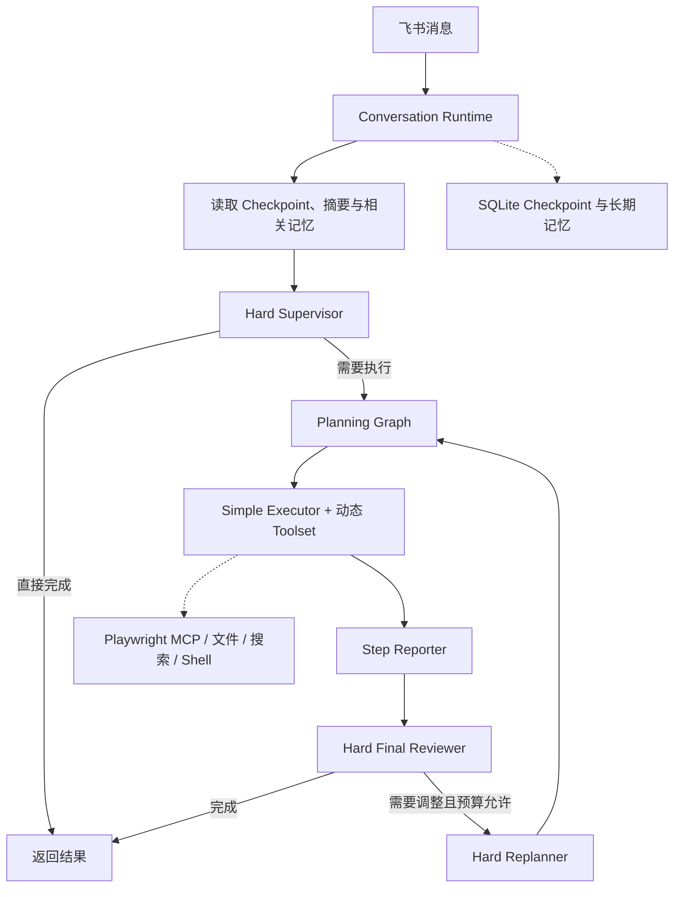

<div align="center">

# PersonalOps Agent

一个运行在飞书里的个人任务 Agent。

[](https://www.python.org/)
[](https://open.feishu.cn/)
[](https://www.deepseek.com/)
[](https://github.com/langchain-ai/langgraph)
[](https://modelcontextprotocol.io/)

它把对话、任务规划、工具调用、长期记忆与本地可观测性组合在同一套运行时中，当前主要面向单用户、本机常驻的使用方式。

</div>

---

## 👤 项目定位

PersonalOps Agent 通过飞书长连接接收消息，并使用 DeepSeek 完成对话理解、任务拆分与结果生成。

对于简单问题，系统可以直接回答；对于需要检索、浏览器操作或文件处理的任务，系统会先判断是否需要规划，再按步骤调用对应工具，最后统一检查结果。

这个项目目前更接近一套个人 Agent 实验实现，而不是开箱即用的 SaaS 产品。代码重点放在运行链路、上下文管理、工具边界和可恢复状态上。

> **面向个人使用：** 当前所有飞书入口共享同一个 owner 会话域，同一用户的消息按顺序执行。设计目标是让个人任务状态保持连续，而不是提供多租户协作能力。

<br>

## ✨ 已实现的能力

### 飞书对话入口

- 使用飞书应用长连接接收消息，无需额外提供公网回调地址
- 单用户消息串行处理，避免连续消息覆盖同一轮状态
- 支持创建、查看和切换独立对话
- 任务执行过程中可回传阶段性进度

可用命令：

```text
/help               查看使用说明
/new [标题]         创建并切换到新对话
/list               查看最近对话
/switch 编号或短ID  切换对话
/current            查看当前对话
```

### 分层任务执行

系统没有把所有请求直接交给一个无限循环的 Agent，而是把职责拆成几个较明确的阶段：

1. **Hard Supervisor** 判断请求可以直接完成，还是需要进入计划执行。
2. **Planning Graph** 生成有限步骤的计划，并集中管理模型轮次、工具调用和重试预算。
3. **Simple Executor** 只处理当前步骤，并按需选择工具集。
4. **Step Reporter** 将执行轨迹整理为结构化步骤报告。
5. **Hard Final Reviewer** 检查任务是否已经完成；必要时允许一次受预算约束的重新规划。

每一层都有明确的次数上限。即使外部工具异常或模型没有按预期返回，流程也会尝试形成可解释的结束状态，而不是无限执行。

### 动态工具集

项目按照能力域组织工具，而不是把全部工具长期暴露给模型。

当前注册的 Toolset 包括：

| Toolset | 用途 |
| --- | --- |
| `WEB_RESEARCH` | 时间确认、网页搜索和公开信息读取 |
| `BROWSER_AUTOMATION` | 页面导航、点击、输入和表单交互 |
| `FILE_INSPECTION` | 目录浏览、文件查找、文本读取与搜索 |
| `FILE_EDITING` | 文本文件创建、写入和精确替换 |
| `SOFTWARE_DEVELOPMENT` | Python、Git、测试及其他 Shell 调试任务 |

Toolset Router 会根据当前任务选择少量能力域；执行过程中也可以通过 `request_toolset` 请求补充工具。缺少必需工具的 Toolset 不会被标记为可用。

### Playwright MCP

浏览器能力通过 Playwright MCP 接入。

程序启动时建立持久 MCP 会话，并从服务端实际返回的工具中按白名单注册浏览器能力。浏览器导航、页面快照、点击、输入和多标签页操作因此可以继续沿用 MCP 的工具协议，而不需要把浏览器逻辑写进主 Agent。

### 多会话与可恢复状态

- LangGraph Checkpoint 使用 SQLite 持久化
- 每个 Conversation 使用独立 thread id
- 对话可通过列表编号或短 ID 切换
- 同一对话的执行和记忆写入保持顺序
- 退出时依次停止消息接收、等待任务结束，再关闭 SQLite、Memory Store 与 MCP 资源

运行数据默认保存在 `.agent/`，该目录不会提交到 Git。

<br>

## 🧩 上下文是如何控制的

项目使用两层摘要，分别处理长期对话和单个步骤中的工具轨迹。

### Conversation Rolling Summary

当对话累计到配置阈值后，较早的对话会被更新为滚动摘要。Hard Supervisor、Replanner 和 Final Reviewer 使用这份摘要，同时只携带有限数量的最近对话。

这样可以保留目标、约束和关键结果，又避免规划节点持续读取完整历史。

### Executor Trace Summary

每个步骤内部还会单独监控消息数量与估算 Token。当工具输出和模型轨迹超过阈值时，较早部分会被摘要，只保留最近若干消息供当前步骤继续执行。

在摘要前，Middleware 会先修复不完整的 AI/Tool 消息对应关系，减少中断恢复后出现非法消息序列的概率。摘要调用失败时，也保留确定性的文本回退路径。

<br>

## 🧠 记忆检索

长期记忆保存在 SQLite Store 中，并使用本地模型完成检索：

- `gte-multilingual-base`：向量表示
- `gte-multilingual-reranker-base`：候选重排
- `Qwen3 GGUF`：轻量记忆路由判断，可通过配置关闭

项目还维护一层内存中的关系图索引，用于从已命中的记忆继续扩展相关节点；SQLite Store 仍然是持久化数据的唯一来源。

模型文件默认下载到 `.models/`，不会提交到仓库。

<br>

## 🔄 运行链路



<br>

## 🚀 本地运行

### 1. 准备环境

项目开发环境为 Python 3.10。仓库同时提供 Conda 和 pip 依赖文件。

```powershell
git clone https://github.com/Huanz86251/personalops-agent.git
cd personalops-agent
conda env create -f environment.yml
conda activate agent
```

首次启动记忆模块时会下载本地模型，因此需要预留磁盘空间并保持网络可用。

浏览器 MCP 通过 `npx` 启动，还需要本机已安装 Node.js。

### 2. 配置环境变量

复制示例文件：

```powershell
Copy-Item .env.example .env
```

至少填写以下配置：

```dotenv
FEISHU_APP_ID=
FEISHU_APP_SECRET=
DEEPSEEK_API_KEY=

LLM_PROVIDER=deepseek
LLM_MODEL=deepseek-v4-flash
HARD_LLM_PROVIDER=deepseek
HARD_LLM_MODEL=deepseek-v4-pro
```

其余规划预算、记忆模型和观测配置可以先沿用 `.env.example` 中的值，再根据本机资源调整。

### 3. 配置飞书应用

在飞书开放平台创建企业自建应用，并为应用配置机器人与消息接收能力。项目使用长连接接收事件，请确保应用侧已经启用相应事件订阅与权限。

不同飞书应用的权限范围可能不同，具体配置以飞书开放平台当前说明为准。

### 4. 启动

```powershell
python main.py
```

启动完成后，终端会保持运行并等待飞书消息。

如果启用了 Phoenix Tracing，可在默认地址查看本地调用轨迹：

```text
http://127.0.0.1:6006
```

Phoenix 启动失败不会阻止飞书入口和 Agent 主流程继续启动。

<br>

## 🗂️ 目录说明

```text
.
├─ main.py                    # 飞书入口与应用生命周期
├─ conversation_runtime.py    # 会话、Checkpoint、Memory 与 MCP 编排
├─ planning_graph.py          # 计划执行状态图
├─ hard_planning.py           # Supervisor、Replanner、Final Reviewer
├─ agent.py                   # Executor Agent 与模型构造
├─ middlewares.py             # 执行预算与 Toolset 路由
├─ context_middlewares.py     # 消息修复、摘要与运行时 Prompt
├─ memory.py                  # 长期记忆提取、解析和检索
├─ memory_graph.py            # 记忆关系图索引
├─ retrieval_models.py        # 本地向量、重排和路由模型
├─ mcp_runtime.py             # Playwright MCP 生命周期
├─ observability.py           # Phoenix / OpenTelemetry 观测
├─ toolsets.py                # Toolset 定义与能力目录
├─ tools/                     # 文件、搜索、时间等基础工具
└─ prompts/                   # 各节点使用的 Prompt
```

运行时目录：

| 路径 | 内容 |
| --- | --- |
| `.agent/` | Checkpoint、长期记忆、Phoenix 数据与浏览器状态 |
| `.models/` | 本地模型缓存 |
| `workspace/` | Agent 文件工具可操作的工作区 |

这些目录已通过 `.gitignore` 排除。

<br>

## 🧭 当前边界

- 当前按单用户个人 Agent 设计，不是多租户服务
- 主要面向 Windows 与本机常驻运行方式
- 浏览器自动化依赖本地 Node.js 和 Playwright MCP
- 本地检索模型会带来额外的磁盘与内存占用
- 工具调用结果仍受目标网站、网络状态和本机权限影响
- 仓库目前以实现代码为主，自动化测试覆盖仍需继续补充

这些限制是当前实现范围的一部分，也为后续迭代留下了清晰边界。

---

<div align="center">

Built as a personal agent runtime for Feishu.

</div>
